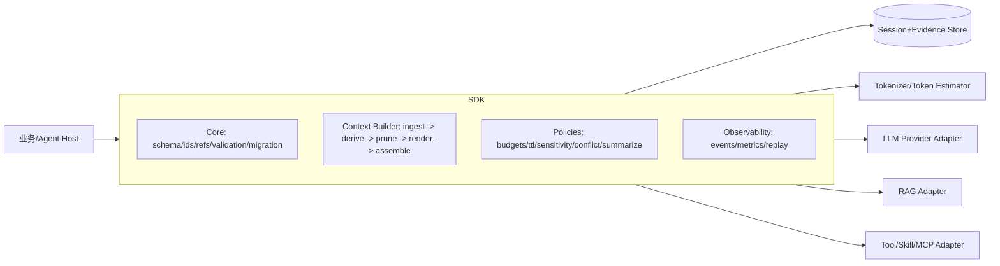
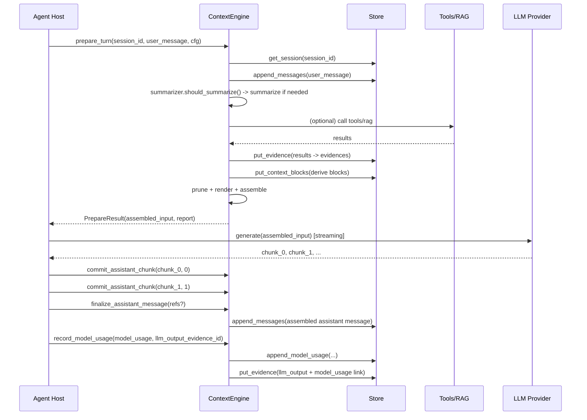
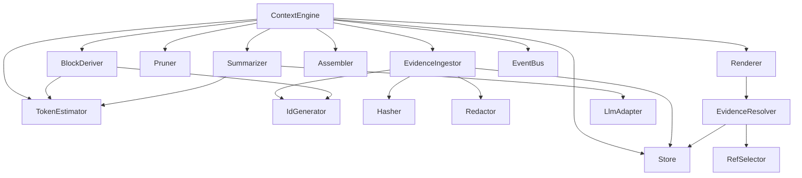

## 上下文结构化建模配套 SDK：方案与架构设计

面向 `context_engineering_model.md` 定义的 schema（`session` / `evidences` / `context_blocks`），提供一套可复用、可观测、可治理的上下文构建 SDK（Python，async-first），用于将多来源信息沉淀为证据、生成可裁剪上下文块、并稳定装配为最终模型输入。

---

## 1. 设计目标与边界

### 1.1 目标（What）

- **标准化数据结构**：围绕 `schema_version`、`session`、`evidences`、`context_blocks` 提供强类型/校验/迁移能力。
- **上下文装配流水线**：将"消息 + 证据 + 派生块"按策略（预算/优先级/时效/敏感）装配为最终输入。
- **证据溯源与可解释**：从回答（`session.messages[].refs` 或 `context_blocks[].refs`）可追溯到 `evidence_id`，并回链到工具调用/模型调用记录。
- **治理与观测**：token 成本、裁剪决策、冲突决策、工具调用、失败重试等可记录、可回放、可 A/B。
- **可扩展**：存储、tokenizer、裁剪策略、渲染策略、RAG/工具接入、隐私脱敏等以插件方式扩展。
- **跨框架接入（关键）**：能以"最小侵入"的方式接入主流开源 Agent 框架（LangChain/LlamaIndex/AutoGen/CrewAI/Haystack/Semantic Kernel 等），复用其运行时（planner/tool router/memory），但把**上下文治理能力**统一沉淀到本 SDK。

### 1.2 非目标（What not）

- 不提供"某一家模型供应商"的强绑定客户端；仅提供**适配层接口**与可选实现。
- 不强制规定具体 DB/缓存；仅提供统一的 `Store` 抽象与参考实现。
- 不在 schema 内加入运行时开关字段（遵循文档"去掉运行态组装字段"的方向）；运行时策略通过 SDK 配置传入。
- 不替代开源框架的编排/执行引擎：SDK 聚焦"上下文数据面（data plane）+ 治理面（control plane）"，不做"控制面（control plane）的编排引擎"。

### 1.3 MVP（最小可用）

遵循文档的 MVP 三件事，SDK 的 MVP 也聚焦三条主线：

- **会话**：写入/读取/追加 `session.messages`，可选滚动摘要。
- **证据**：统一写入 `evidences`，提供去重/脱敏/引用能力。
- **上下文块**：生成/裁剪/装配 `context_blocks`，输出最终输入文本（或结构化 prompt parts）。

### 1.4 兼容开源 Agent 框架的设计原则（How）

为确保能适配"框架各自的对话/工具/检索/模型调用生命周期"，SDK 采用以下约束：

- **Host-owned execution**：默认假设"LLM 调用与工具调用由 Agent 框架/业务宿主负责"，SDK 通过钩子记录与装配，不强行接管执行。
- **Two-phase turn API**：提供"准备输入（prepare/assemble）"与"落盘归因（commit/record）"两阶段 API，便于框架在其既有生命周期里插入。
- **事件驱动但可关闭**：所有关键动作产出结构化事件（可接入 OTel/日志/指标），但不强制依赖任何观测栈。
- **幂等与并发友好**：append/put 支持幂等 key（如 `tool_call_id`、`model_usage_id`），Store 支持乐观锁或幂等追加。

### 1.5 实现语言

首选 **Python**（async-first），后续可扩展到 TypeScript 等。

---

## 2. 使用场景与典型用户

### 2.1 典型场景

- **对话式 Agent**：多轮会话逐步增长，需摘要压缩 + 证据治理 + 可解释输出。
- **任务型 Agent**：有 `todo_list.tasks`，需把每个 task 的工具调用/证据产出归因到 task。
- **企业内知识问答**：RAG 命中文档作为证据落库，支持版本/时效/冲突检测与审计。
- **工具编排**：多工具/skills（含 MCP）调用，可重放、可定位问题在模型还是工具。

### 2.2 典型用户

- **平台团队**：提供统一 SDK 给多业务线使用；关注可扩展/可治理/可观测。
- **业务团队**：用最少改造接入；关注"能跑起来、效果稳定、成本可控"。

---

## 3. 总体架构

### 3.1 分层

- **Core（内核）**：schema 类型、校验、迁移、id 生成、refs 解析、基础工具。
- **Context Builder（上下文构建器）**：证据入库 → 块生成 → 策略裁剪 → 渲染装配 → 输出/存档。
- **Adapters（适配器）**：存储（DB/对象存储）、tokenizer、模型供应商、RAG、工具/skills（含 MCP）。
- **Policies（策略包）**：裁剪策略、摘要策略、冲突策略、脱敏策略。
- **Observability（观测）**：事件、日志、指标、回放、A/B 标签。

### 3.2 架构图（逻辑）



---

## 4. 模块划分与包结构（建议）

适合做成一个单仓多包（或单包多模块）的结构；以下以"多包"描述：

- `@ce/sdk-core`
  - schema 类型/校验（JSON Schema）
  - `IdGenerator`、`Clock`、`Hasher`、`Redactor`
  - `RefSelector`（selector 解析/裁切）
  - `Migrator`（schema_version 迁移）
- `@ce/sdk-store`
  - `Store` 抽象（会话/证据/块/索引）
  - 参考实现：`MemoryStore`、`FileStore`（本地 JSON）、`SqlStore`（可选）
- `@ce/sdk-context-builder`
  - `Ingestor`、`Deriver`、`Pruner`、`Renderer`、`Assembler`
  - `ContextEngine`（一站式编排）
- `@ce/sdk-policies`
  - 裁剪策略（预算、优先级保底、TTL、敏感分级）
  - 摘要策略（滚动摘要覆盖范围）
  - 冲突策略（证据冲突检测/选择/提示）
- `@ce/sdk-adapters`
  - tokenizer/计费 token 估算适配
  - LLM provider 适配
  - RAG 与工具/skills/MCP 适配
- `@ce/sdk-integrations`
  - 面向"开源 Agent 框架"的集成适配（不改变 schema，只做生命周期映射）
  - 参考：`@ce/integrations-langchain`、`@ce/integrations-llamaindex`、`@ce/integrations-autogen`、`@ce/integrations-semantic-kernel` 等
- `@ce/sdk-observability`
  - 事件总线 + 指标接口 + 回放记录格式

---

## 5. 核心数据对象与不变式（Invariants）

SDK 需要强制或强烈建议以下一致性（避免"能写进 JSON 但不可治理"）：

- **ID 一致性**：
  - `session.session_id` 必须存在且稳定。
  - `evidences` 的 key 与 `evidences.{id}.evidence_id` 建议一致（可校验）。
  - `context_blocks[].block_id` 必须唯一。
- **引用一致性**：
  - `refs[].evidence_id` 必须能在 `evidences` 中解析（或明确为远程引用模式）。
  - selector 解析失败必须可观测（事件 + 可降级策略）。
- **可解释性链路（推荐）**：
  - 工具调用结果落为 `evidences[type=tool_result|rag_doc|skill_output]`，并通过 `links.tool_call_id` 回链。
  - 模型输出（含中间产物）落为 `evidences[type=llm_output]`，并通过 `links.model_usage_id` 回链。

### 5.1 数据类型定义（Python）

SDK 首选实现语言为 Python（后续可扩展到 TypeScript 等）。以下为所有核心数据对象的形式化定义，采用 `dataclass` + `Enum`，与 `context_engineering_model.md` 的 JSON 示例严格对齐。

#### 5.1.1 枚举类型

```python
from enum import Enum

class Role(str, Enum):
    SYSTEM = "system"
    USER = "user"
    ASSISTANT = "assistant"
    TOOL = "tool"

class AuthorKind(str, Enum):
    USER = "user"
    AGENT = "agent"
    TOOL = "tool"
    SYSTEM = "system"

class EvidenceType(str, Enum):
    RAG_DOC = "rag_doc"
    TOOL_RESULT = "tool_result"
    SKILL_OUTPUT = "skill_output"
    LLM_OUTPUT = "llm_output"
    USER_INPUT = "user_input"
    OTHER = "other"

class SourceKind(str, Enum):
    RAG = "rag"
    TOOL = "tool"
    SKILL = "skill"
    LLM = "llm"
    USER = "user"
    SYSTEM = "system"

class BlockType(str, Enum):
    INSTRUCTION = "instruction"
    CONVERSATION = "conversation"
    STATE = "state"
    PLAN = "plan"
    EVIDENCE = "evidence"
    MEMORY = "memory"

class Priority(str, Enum):
    MUST = "must"
    HIGH = "high"
    MEDIUM = "medium"
    LOW = "low"

class ToolCallStatus(str, Enum):
    SUCCESS = "success"
    TIMEOUT = "timeout"
    FORBIDDEN = "forbidden"
    NOT_FOUND = "not_found"
    ERROR = "error"

class ProviderKind(str, Enum):
    BUILTIN = "builtin"
    MCP = "mcp"
    OTHER = "other"

class ToolType(str, Enum):
    TOOL = "tool"
    SKILL = "skill"
    FUNCTION_CALL = "function_call"

class ModelUsageStage(str, Enum):
    ROUTE = "route"
    PLAN = "plan"
    TOOL_CALL = "tool_call"
    ANSWER = "answer"
    SUMMARIZE = "summarize"
    OTHER = "other"

class ModelUsageStatus(str, Enum):
    SUCCESS = "success"
    ERROR = "error"

class TaskStatus(str, Enum):
    PENDING = "pending"
    IN_PROGRESS = "in_progress"
    COMPLETED = "completed"
    FAILED = "failed"
    CANCELLED = "cancelled"
```

#### 5.1.2 核心数据类

```python
from dataclasses import dataclass, field

@dataclass
class Author:
    kind: AuthorKind
    id: str

@dataclass
class Ref:
    evidence_id: str
    selector: str | None = None   # 格式见 RefSelector 章节

@dataclass
class Message:
    role: Role
    content: str
    author: Author | None = None
    at: str | None = None         # ISO 8601
    refs: list[Ref] | None = None

@dataclass
class MessageIndexRange:
    from_index: int
    to_index: int

@dataclass
class Summary:
    content: str
    updated_at: str               # ISO 8601
    message_index_range: MessageIndexRange

@dataclass
class Task:
    task_id: str
    name: str
    status: TaskStatus = TaskStatus.PENDING
    depends_on: list[str] = field(default_factory=list)
    result_evidence_ids: list[str] = field(default_factory=list)
    error: str = ""

@dataclass
class TodoList:
    tasks: list[Task] = field(default_factory=list)

@dataclass
class TaskState:
    todo_list: TodoList = field(default_factory=TodoList)

@dataclass
class ToolProvider:
    kind: ProviderKind
    name: str = ""
    uri: str = ""

@dataclass
class ToolCall:
    tool_call_id: str
    tool: str
    provider: ToolProvider
    type: ToolType = ToolType.TOOL
    called_at: str = ""           # ISO 8601
    args_digest: dict = field(default_factory=dict)
    status: ToolCallStatus = ToolCallStatus.SUCCESS
    duration_ms: int = 0
    result_evidence_ids: list[str] = field(default_factory=list)
    task_id: str | None = None

@dataclass
class ToolState:
    tool_calls: list[ToolCall] = field(default_factory=list)

@dataclass
class ModelUsage:
    model_usage_id: str
    provider: str
    model: str
    stage: ModelUsageStage = ModelUsageStage.OTHER
    params: dict = field(default_factory=dict)
    prompt_tokens: int = 0
    completion_tokens: int = 0
    total_tokens: int = 0
    first_token_latency_ms: int | None = None
    latency_ms: int = 0
    status: ModelUsageStatus = ModelUsageStatus.SUCCESS
    error: str = ""
    task_id: str | None = None

@dataclass
class Session:
    session_id: str
    messages: list[Message] = field(default_factory=list)
    summary: Summary | None = None
    task_state: TaskState = field(default_factory=TaskState)
    tool_state: ToolState = field(default_factory=ToolState)
    model_usage: list[ModelUsage] = field(default_factory=list)

@dataclass
class EvidenceSource:
    kind: SourceKind
    name: str = ""
    uri: str = ""

@dataclass
class EvidenceLinks:
    model_usage_id: str | None = None
    tool_call_id: str | None = None

@dataclass
class Evidence:
    evidence_id: str
    type: EvidenceType
    source: EvidenceSource
    content: str = ""
    confidence: float | None = None
    metadata: dict = field(default_factory=dict)
    links: EvidenceLinks = field(default_factory=EvidenceLinks)

@dataclass
class ContextBlock:
    block_id: str
    block_type: BlockType
    priority: Priority
    token_estimate: int = 0
    content: str = ""
    refs: list[Ref] = field(default_factory=list)

@dataclass
class AgentInfo:
    agent_id: str
    name: str = ""
    version: str = ""

@dataclass
class Actor:
    user_id: str = ""
    user_role: str = ""
    agent: AgentInfo | None = None

@dataclass
class Meta:
    locale: str = ""
    created_at: str = ""          # ISO 8601
    updated_at: str = ""          # ISO 8601
    actor: Actor | None = None
```

#### 5.1.3 顶层文档与接口返回类型

```python
@dataclass
class SessionDocument:
    schema_version: str
    session: Session
    evidences: dict[str, Evidence] = field(default_factory=dict)
    context_blocks: list[ContextBlock] = field(default_factory=list)
    meta: Meta | None = None

@dataclass
class PutResult:
    success: bool
    version: int                  # 乐观锁版本号，每次写入递增
    error: str | None = None

@dataclass
class RenderedBlock:
    block_id: str
    block_type: BlockType
    priority: Priority
    rendered_content: str         # refs 已解析为实际文本片段
    token_estimate: int

@dataclass
class MessagePart:
    role: Role
    content: str

@dataclass
class AssembledInput:
    parts: list[MessagePart]      # 结构化形态（适配不同 provider 的多段输入）
    text: str | None = None       # 文本形态（可选，部分 provider 需要单一字符串）
    total_tokens: int             # 预估 token 总量

@dataclass
class PruneDecision:
    block_id: str
    action: str                   # "kept" | "dropped" | "degraded"
    reason: str
    token_estimate: int

@dataclass
class ConflictRecord:
    evidence_ids: list[str]       # 冲突的证据 ID 列表
    field_path: str               # 冲突字段路径
    resolution: str               # 采用的解决策略
    detail: str = ""

@dataclass
class RedactionRecord:
    evidence_id: str
    rules_applied: list[str]
    fields_redacted: int

@dataclass
class Report:
    turn_id: str
    new_evidence_ids: list[str]
    new_block_ids: list[str]
    prune_decisions: list[PruneDecision]
    conflicts: list[ConflictRecord]
    redactions: list[RedactionRecord]
    token_budget: int
    token_used: int
    degradations: list[str]       # 降级路径记录
    errors: list[str]

@dataclass
class PrepareResult:
    assembled_input: AssembledInput
    report: Report
    session_version: int | None = None
```

---

## 6. 关键抽象与接口（Python，async-first）

所有涉及 IO 的方法采用 `async def`（见第 17 节"异步模型"说明）。以 Python `Protocol` 描述接口契约。

### 6.1 `Store`：会话/证据/块的持久化与并发控制

#### 查询过滤类型

```python
@dataclass
class EvidenceFilter:
    types: list[EvidenceType] | None = None
    source_kinds: list[SourceKind] | None = None
    since: str | None = None          # ISO 8601，只返回此时间之后创建的证据
    until: str | None = None          # ISO 8601，只返回此时间之前创建的证据
    tags: dict[str, str] | None = None
    limit: int | None = None

@dataclass
class BlockFilter:
    block_types: list[BlockType] | None = None
    priorities: list[Priority] | None = None
    min_priority: Priority | None = None  # 返回 >= 此优先级的所有块
    limit: int | None = None
```

#### 接口定义

```python
from typing import Protocol

class Store(Protocol):
    # --- Session ---
    async def get_session(self, session_id: str) -> SessionDocument | None: ...
    async def put_session(self, session_id: str, doc: SessionDocument,
                          expected_version: int | None = None) -> PutResult: ...
    async def append_messages(self, session_id: str,
                              messages: list[Message]) -> PutResult: ...
    async def patch_session(self, session_id: str, patch: dict,
                            expected_version: int | None = None) -> PutResult: ...

    # --- Evidence ---
    async def put_evidence(self, session_id: str,
                           evidence: Evidence) -> str: ...   # 返回 evidence_id
    async def get_evidence(self, session_id: str,
                           evidence_id: str) -> Evidence | None: ...
    async def list_evidences(self, session_id: str,
                             filter: EvidenceFilter | None = None) -> list[Evidence]: ...

    # --- Context Blocks ---
    async def put_context_blocks(self, session_id: str,
                                 blocks: list[ContextBlock]) -> PutResult: ...
    async def list_context_blocks(self, session_id: str,
                                  filter: BlockFilter | None = None) -> list[ContextBlock]: ...

    # --- Tool / Model / Task（便捷方法，也可通过 patch_session 实现） ---
    async def append_tool_calls(self, session_id: str, tool_calls: list[ToolCall],
                                expected_version: int | None = None) -> PutResult: ...
    async def append_model_usage(self, session_id: str, usages: list[ModelUsage],
                                 expected_version: int | None = None) -> PutResult: ...
    async def upsert_tasks(self, session_id: str, tasks: list[Task],
                           expected_version: int | None = None) -> PutResult: ...
```

设计要点：
- **并发控制**：支持 `expected_version`（乐观锁）；写入时版本不匹配抛出 `VersionConflictError`。
- **分离存储（可选）**：证据可落对象存储/向量库；`evidences` 中仅存元数据 + 指针。
- **面向框架的最小原语**：即便 Store 不提供 `append_tool_calls/append_model_usage/upsert_tasks` 的专门方法，也必须能通过 `patch_session/put_session` 覆盖 `session.tool_state`、`session.model_usage`、`session.task_state` 的写入需求。
- **参考实现**：SDK 提供 `MemoryStore`（内存/测试用）、`FileStore`（本地 JSON）；可选 `SqlStore`。

### 6.2 `TokenEstimator`：token 预算相关的统一入口

```python
class TokenEstimator(Protocol):
    def estimate_text(self, text: str, model_hint: str | None = None) -> int: ...
    def estimate_message(self, role: Role, content: str,
                         model_hint: str | None = None) -> int: ...
    def estimate_messages(self, messages: list[Message],
                          model_hint: str | None = None) -> int: ...
```

要求：
- 纯计算，不涉及 IO，因此为同步方法。
- 支持"无 tokenizer 时的退化估算"：SDK 内置 `CharBasedEstimator`（中文约 2 token/字，英文约 0.75 token/word）。
- 支持不同模型的 token 估算策略：可插拔 `TiktokenEstimator`（OpenAI 系列）等。

### 6.3 `EvidenceIngestor`：统一落证据（去重、脱敏、置信度）

```python
@dataclass
class IngestOptions:
    redact: bool = True               # 是否执行脱敏
    dedup: bool = True                # 是否去重
    confidence: float | None = None   # 外部提供的置信度（优先于规则推断）

class EvidenceIngestor(Protocol):
    async def ingest(self, content: str, source: EvidenceSource,
                     evidence_type: EvidenceType,
                     links: EvidenceLinks | None = None,
                     metadata: dict | None = None,
                     options: IngestOptions | None = None) -> Evidence: ...
```

行为约定：
- **去重**：基于 `source.uri + content_hash` 或 `args_digest`；命中已有证据时返回已有 `Evidence`（不重复写入）。
- **脱敏**：调用注入的 `Redactor` 处理 `content`；脱敏前后可选双版本存储。
- **ID 生成**：内部调用 `IdGenerator` 生成 `evidence_id`（默认 UUID v4）。
- **置信度**：优先使用 `options.confidence`；否则按规则推断（如 RAG score 映射）。

### 6.4 `BlockDeriver`：从证据/状态派生上下文块

```python
@dataclass
class DeriveOptions:
    include_conversation: bool = True
    include_state: bool = True
    include_evidences: bool = True
    custom_instructions: list[ContextBlock] | None = None  # 外部注入的固定指令块

class BlockDeriver(Protocol):
    async def derive(self, session_doc: SessionDocument,
                     evidences: list[Evidence],
                     options: DeriveOptions | None = None) -> list[ContextBlock]: ...
```

块类型建议最少覆盖：
- `instruction`（固定规则/口径片段）
- `conversation`（必要对话片段，含 summary 降级）
- `state` / `plan`（意图/任务/关键状态）
- `evidence`（可引用证据渲染/摘要）
- `memory`（长期记忆或偏好）

派生规则（可由具体实现扩展）：
- 每条 `session.messages` -> 一个 `conversation` 块（priority 按 recency 递减）。
- 每条 evidence -> 一个 `evidence` 块（priority 按 confidence / recency）。
- `session.task_state` -> 一个 `state` 或 `plan` 块（priority=high）。
- `session.summary`（如存在）-> 一个 `conversation` 块（priority=high，替代被摘要覆盖的 messages）。

### 6.5 `Pruner`：裁剪策略引擎（可解释决策）

```python
@dataclass
class PruneBudget:
    max_tokens: int
    tier_budgets: dict[Priority, int] | None = None  # 可选：按优先级分配配额

@dataclass
class PruneRules:
    must_keep_priorities: list[Priority] = field(default_factory=lambda: [Priority.MUST])
    ttl_seconds: dict[Priority, int] | None = None   # 按优先级的 TTL（秒）
    now: str | None = None                            # 当前时间（ISO 8601），用于 TTL 计算

@dataclass
class PruneResult:
    kept: list[ContextBlock]
    dropped: list[ContextBlock]
    decisions: list[PruneDecision]

class Pruner(Protocol):
    def prune(self, blocks: list[ContextBlock], budget: PruneBudget,
              rules: PruneRules | None = None) -> PruneResult: ...
```

必备能力：
- **保底规则**：`priority=must` 永不丢弃（除非超预算则触发降级策略，降级由 `DegradeCallback` 处理）。
- **预算策略**：按 `token_estimate` 贪心/分组/多目标优化。
- **时效策略**：TTL/时间窗；过期块优先丢弃或降级为摘要。
- **敏感策略**：按分级过滤或替换为脱敏版本。
- **报告**：每个块输出 `PruneDecision`（action + reason + token_estimate）。
- 纯计算，同步方法。

### 6.6 `Renderer` & `Assembler`：渲染 refs 并装配最终输入

```python
@dataclass
class RenderHints:
    max_chars: int | None = None     # 单块渲染最大字符数（超出则截断/摘要）
    format: str = "text"             # "text" | "markdown" | "json"

class EvidenceResolver(Protocol):
    async def resolve(self, evidence_id: str,
                      selector: str | None = None) -> str: ...

class Renderer(Protocol):
    async def render_block(self, block: ContextBlock,
                           resolver: EvidenceResolver,
                           hints: RenderHints | None = None) -> RenderedBlock: ...

class Assembler(Protocol):
    def assemble(self, messages: list[Message],
                 rendered_blocks: list[RenderedBlock],
                 model_hint: str | None = None) -> AssembledInput: ...
```

- `EvidenceResolver`：从 Store 加载证据并按 selector 提取片段的桥接接口，SDK 内置默认实现。
- `Renderer`：将 block 的 `refs` 通过 resolver 解析为实际文本，生成 `RenderedBlock`。async 因为可能需要从 Store 加载证据。
- `Assembler`：将 messages + rendered_blocks 按 role 排列、合并为最终 `AssembledInput`。纯计算，同步方法。

输出形态：
- **结构化形态**（默认）：`AssembledInput.parts`（`list[MessagePart]`），适配不同 provider 的多段输入。
- **文本形态**（可选）：`AssembledInput.text`，部分 provider 需要单一字符串。

### 6.7 `ContextEngine`：面向"框架宿主"的编排入口

`ContextEngine` 是 SDK 的一站式门面，串联 Ingestor -> Deriver -> Pruner -> Renderer -> Assembler，并管理 Store 读写与事件发射。

```python
class ContextEngine(Protocol):

    # === Phase A：准备本轮模型输入 ===
    async def prepare_turn(self, session_id: str,
                           user_message: Message,
                           runtime_config: RuntimeConfig) -> PrepareResult: ...

    # === Phase B：记录 assistant 回复 ===
    # 批量提交（流结束后一次性）
    async def commit_assistant_message(self, session_id: str,
                                       assistant_message: Message,
                                       refs: list[Ref] | None = None) -> PutResult: ...
    # 流式增量提交
    async def commit_assistant_chunk(self, session_id: str,
                                     chunk: str,
                                     chunk_index: int) -> None: ...
    async def finalize_assistant_message(self, session_id: str,
                                         refs: list[Ref] | None = None) -> PutResult: ...

    # === Phase C：记录工具调用与模型用量（可选但强烈建议） ===
    async def record_tool_call(self, session_id: str,
                               tool_call: ToolCall,
                               result_evidence_ids: list[str] | None = None) -> PutResult: ...

    async def record_model_usage(self, session_id: str,
                                 model_usage: ModelUsage,
                                 llm_output_evidence_id: str | None = None) -> PutResult: ...
```

`PrepareResult.report`（类型 `Report`）包含：
- 本轮新增 evidences/context_blocks 的 id
- 裁剪/冲突/脱敏等关键决策（`PruneDecision` / `ConflictRecord` / `RedactionRecord`）
- token 估算与预算占用
- 失败与降级路径

**流式回复工作流**：
1. `prepare_turn()` -> 获得 `assembled_input`
2. 调用 LLM 流式生成 -> 每收到 chunk 调用 `commit_assistant_chunk(session_id, chunk, index)`
3. 流结束后调用 `finalize_assistant_message(session_id, refs)` -> 拼合 chunks 为完整 message 并持久化

### 6.8 Core 工具接口

以下接口属于 `@ce/sdk-core` 包，为其他组件提供基础能力。

#### `IdGenerator`：ID 生成

```python
import uuid

class IdGenerator(Protocol):
    def generate(self) -> str: ...

class UuidV4Generator:
    """默认实现：UUID v4"""
    def generate(self) -> str:
        return str(uuid.uuid4())
```

#### `Clock`：时间源（可注入，便于测试）

```python
from datetime import datetime, timezone

class Clock(Protocol):
    def now_iso(self) -> str: ...

class SystemClock:
    """默认实现：系统时钟"""
    def now_iso(self) -> str:
        return datetime.now(timezone.utc).isoformat()
```

#### `Hasher`：内容哈希（用于去重）

```python
import hashlib

class Hasher(Protocol):
    def digest(self, content: str) -> str: ...

class Sha256Hasher:
    """默认实现：SHA-256"""
    def digest(self, content: str) -> str:
        return hashlib.sha256(content.encode("utf-8")).hexdigest()
```

#### `Redactor`：脱敏处理

```python
@dataclass
class RedactionRules:
    patterns: list[str] = field(default_factory=list)       # 正则表达式
    field_paths: list[str] = field(default_factory=list)     # JSON 字段路径
    dictionaries: list[str] = field(default_factory=list)    # 命名字典（如 "pii", "internal_urls"）

@dataclass
class RedactResult:
    redacted_text: str
    applied_rules: list[str]      # 命中的规则名
    has_sensitive: bool            # 是否检测到敏感内容

class Redactor(Protocol):
    async def redact(self, text: str,
                     rules: RedactionRules | None = None) -> RedactResult: ...
```

- async 因为某些脱敏实现可能需要调用外部服务（如 PII 检测 API）。
- SDK 内置 `RegexRedactor`（正则替换）作为默认实现。

#### `RefSelector`：selector 解析与内容提取

selector 格式规范（可扩展）：

| 格式 | 示例 | 语义 |
|---|---|---|
| `lines:from-to` | `lines:12-18` | 按行号范围提取 |
| `chars:from-to` | `chars:120-260` | 按字符偏移量提取 |
| `json:$.path` | `json:$.data.items[0].name` | JSONPath 提取 |
| `regex:pattern` | `regex:def\\s+\\w+` | 正则匹配提取 |
| 组合（逗号分隔） | `lines:12-18,chars:120-260` | 多选择器取交集 |

```python
@dataclass
class ParsedSelector:
    type: str                     # "lines" | "chars" | "json" | "regex"
    params: dict                  # 如 {"from": 12, "to": 18}

class RefSelector:
    def parse(self, selector: str) -> list[ParsedSelector]: ...
    def extract(self, content: str, selector: str) -> str: ...
```

- 纯计算，同步方法。
- `extract` 在 selector 格式错误时抛出 `SelectorResolveError`。

#### `Migrator`：schema 版本迁移

```python
@dataclass
class MigrateResult:
    doc: SessionDocument
    from_version: str
    to_version: str
    changes: list[str]            # 迁移操作日志（如 "renamed field X to Y", "added default for Z"）

class Migrator(Protocol):
    def current_version(self) -> str: ...
    def can_migrate(self, from_version: str) -> bool: ...
    def migrate(self, doc: dict, from_version: str) -> MigrateResult: ...
```

### 6.9 `Summarizer`：滚动摘要生成

SDK 内部调用 LLM 生成摘要（需注入 LLM adapter）。

```python
@dataclass
class SummarizeConfig:
    max_summary_tokens: int = 512             # 摘要最大 token 数
    trigger_message_count: int = 20           # 消息数超过此值时触发摘要
    trigger_token_threshold: int = 4096       # 消息总 token 超过此值时触发摘要
    preserve_recent_messages: int = 5         # 保留最近 N 条消息不被摘要覆盖

class Summarizer(Protocol):
    async def should_summarize(self, session: Session,
                                config: SummarizeConfig) -> bool: ...
    async def summarize(self, messages: list[Message],
                        existing_summary: Summary | None = None,
                        config: SummarizeConfig | None = None) -> Summary: ...
```

行为约定：
- `should_summarize`：根据 `trigger_message_count` 和 `trigger_token_threshold` 判断是否需要触发摘要。
- `summarize`：调用注入的 LLM adapter 生成摘要，返回新的 `Summary`（含 `message_index_range`）。
- 增量模式：如果已有 `existing_summary`，则在其基础上增量更新（只处理 `message_index_range.to_index` 之后的新消息）。
- 摘要生成本身会记录为 `model_usage`（`stage=summarize`）和 `evidences[type=llm_output]`。

触发时机：
- `ContextEngine.prepare_turn()` 内部在 `derive` 之前检查是否需要摘要。
- 也可由调用方手动调用（如离线批量压缩历史会话）。

### 6.10 `LlmAdapter`：摘要等内部 LLM 调用的适配接口

```python
@dataclass
class LlmRequest:
    messages: list[MessagePart]
    model: str | None = None
    max_tokens: int | None = None
    temperature: float = 0.3

@dataclass
class LlmResponse:
    content: str
    model: str
    prompt_tokens: int = 0
    completion_tokens: int = 0
    total_tokens: int = 0
    latency_ms: int = 0

class LlmAdapter(Protocol):
    async def generate(self, request: LlmRequest) -> LlmResponse: ...
```

- 仅用于 SDK 内部功能（摘要生成、可选的降级摘要等），不替代框架/宿主的 LLM 调用。
- SDK 不提供具体 provider 实现；由调用方注入。

---

## 7. 端到端流水线（推荐时序）

### 7.1 时序图



### 7.2 重要设计点

- **工具/检索结果先落证据，再派生块**：避免把"长片段"直接塞进 prompt。
- **块可仅 refs，不必 content**：渲染时再按 selector 取片段/摘要。
- **回答 refs**：支持两种方式：
  - 在 `session.messages[assistant].refs` 写引用（面向"回答可解释"）
  - 在 `context_blocks[].refs` 写引用（面向"输入可解释"）
- **摘要时机**：在 `prepare_turn` 的 `derive` 阶段之前，检查并按需触发滚动摘要。

---

## 8. 策略体系设计

### 8.1 预算（Budget）

建议统一 `Budget` 模型：

- `max_input_tokens`：模型输入上限（按 provider）
- `reserved_for_reply_tokens`：预留回复 token
- `max_context_tokens = max_input_tokens - reserved...`
- 分层预算（可选）：`must`、`high`、`medium`、`low` 各自配额

### 8.2 裁剪（Prune）

建议提供至少三种内置策略：

- **GreedyPriorityPruner（MVP）**：must 保底，剩余按 priority + recency + token 占用排序贪心。
- **GroupAwarePruner**：同一 evidence 派生的多个块按组裁剪，避免只留半截导致不可读。
- **DegradeToSummaryPruner**：超预算时，把部分块降级为摘要块（会调用 `LlmAdapter` 生成摘要证据 `evidences[type=llm_output]`，或生成 `context_blocks[content=summary]`）。

### 8.3 冲突检测（Conflict）

证据冲突的最小治理能力（可选但建议）：

- **同一字段多来源**：如订单状态来自工具与 wiki 不一致。
- 冲突策略选项：
  - `prefer_tool_over_rag`
  - `prefer_latest_by_at`
  - `keep_both_and_warn`（在上下文中显式标注冲突）

### 8.4 隐私与脱敏（Redaction）

SDK 提供：
- `Redactor` 接口（正则、字典、结构化字段路径）——见 6.8 节定义。
- "脱敏前后"双版本证据（或仅保存脱敏版本，取决于合规）
- 审计模式开关（默认不保存原文或将原文写入高权限存储）

---

## 9. 可观测性与回放（Observability & Replay）

### 9.1 事件模型

SDK 内部每轮产生事件（可订阅）：

- `SessionLoaded`
- `MessageAppended`
- `SummaryGenerated`
- `ToolCalled` / `ToolCallCompleted`
- `EvidenceIngested`
- `BlocksDerived`
- `PruneCompleted`（含 dropped reasons）
- `Assembled`
- `AssistantChunkReceived` / `AssistantMessageFinalized`
- `Persisted`
- `Error` / `Degraded`

### 9.2 `EventBus`：事件发布/订阅接口

```python
from typing import Callable, Any

@dataclass
class Event:
    event_type: str               # 如 "SessionLoaded", "PruneCompleted"
    session_id: str
    turn_id: str | None = None
    task_id: str | None = None
    tool_call_id: str | None = None
    model_usage_id: str | None = None
    ts: str = ""                  # ISO 8601
    tags: dict[str, str] = field(default_factory=dict)
    payload: dict[str, Any] = field(default_factory=dict)

EventHandler = Callable[[Event], Any]  # 同步或 async 均可

class EventBus(Protocol):
    async def emit(self, event: Event) -> None: ...
    def on(self, event_type: str, handler: EventHandler) -> None: ...
    def off(self, event_type: str, handler: EventHandler) -> None: ...
    def on_all(self, handler: EventHandler) -> None: ...
```

- `emit` 为 async，支持异步 handler（如写入远程日志）。
- SDK 内置 `InMemoryEventBus`（默认）；可扩展为 OpenTelemetry / Kafka / 日志文件等。
- `on_all` 用于注册通配 handler（如全量审计日志）。

### 9.3 回放

回放需要的最少信息：
- `session.messages`（含 at）
- `tool_calls` + `args_digest` + `result_evidence_ids`
- `model_usage`（可选）
- 关键策略配置快照（不放进 schema；但可作为回放元数据单独存档）

---

## 10. 版本演进与兼容（schema_version）

### 10.1 迁移策略

提供 `Migrator`（见 6.8 节接口定义）：
- 输入：任意历史版本 doc
- 输出：当前版本 doc + 迁移报告
- 记录：迁移操作日志（发生了哪些字段重命名/补默认值/删除字段）

### 10.2 兼容原则

- **新增字段**：默认向后兼容
- **字段重命名/语义变化**：必须提供迁移器
- **删除字段**：至少保留一个大版本的读兼容

---

## 11. 参考落地形态（部署/接入）

### 11.1 作为库（Library）

业务服务直接调用：
- 适合单体或少数服务
- 简单、低延迟

### 11.2 作为服务（Context Service）

SDK 内核下沉为独立服务：
- 多语言业务只走 HTTP/gRPC
- 统一治理（策略、审计、缓存）
- 更适合平台化

建议做法：
- SDK 同时提供"库模式"和"服务模式"的同构接口（同一 `ContextEngine` 语义，transport 不同）。

---

## 12. 与 MCP/工具/检索 的对接约定

### 12.1 工具调用记录

SDK 应提供帮助函数把调用写入 `session.tool_state.tool_calls[]`：
- `provider.kind = mcp|builtin|other`
- 记录 `provider.name`、`provider.uri`（如 `mcp://server` 或 registry url）
- `args_digest`：只存摘要/脱敏后的入参（避免泄露）
- 结果统一落 `evidences`，并回链 `links.tool_call_id`

### 12.2 检索（RAG）

把 `rag_search` 视为工具调用：
- 命中文档片段落为 `evidences[type=rag_doc]`
- metadata 可包含：`doc_version`、`effective_at`、`domain`、`tags`

---

## 13. 安全与合规

- **默认最小化存储**：证据 content 可选不落库（仅落指针）以降低风险；但会降低可复现性。
- **分级存储**：敏感证据存高权限域，`evidences` 仅存引用与脱敏摘要。
- **审计与删除**：支持按 `user_id/session_id/evidence_id` 的删除与可追踪（满足合规要求）。

---

## 14. 交付物与里程碑（建议）

### 14.1 v0（MVP，1-2 周）

- schema 校验（JSON Schema）+ `Store`（Memory/File）
- `EvidenceIngestor`（去重 + 简单脱敏）
- `BlockDeriver`（最小：conversation/state/evidence）
- `GreedyPriorityPruner` + 简单 token 估算（`CharBasedEstimator`）
- `Assembler` 输出文本输入
- 基础事件与裁剪报告
- 流式回复接口（`commit_assistant_chunk` + `finalize_assistant_message`）

### 14.2 v1（平台化，3-6 周）

- 可插拔 tokenizer（按模型真实计费）
- 摘要与降级策略（`Summarizer` + `DegradeToSummaryPruner`）
- 冲突检测策略
- 存储适配（SQL/Redis/对象存储）
- 回放工具（Replay CLI/SDK）
- A/B 标签与指标接入（OpenTelemetry/Prometheus）

---

## 15. 附：建议的配置模型（RuntimeConfig）

SDK 不把策略写进 schema，但建议统一一份运行时配置：

```python
@dataclass
class BudgetConfig:
    max_input_tokens: int = 8192
    reserved_reply_tokens: int = 1024

@dataclass
class PruneConfig:
    must_keep_priorities: list[Priority] = field(default_factory=lambda: [Priority.MUST])
    ttl_seconds: dict[str, int] | None = None  # 如 {"low": 3600}

@dataclass
class RedactionConfig:
    enabled: bool = True
    mode: str = "store_redacted_only"  # "store_redacted_only" | "dual_store"
    rules: RedactionRules | None = None

@dataclass
class ObservabilityConfig:
    emit_events: bool = True
    include_reports_in_store: bool = True

@dataclass
class SummaryConfig:
    enabled: bool = True
    max_summary_tokens: int = 512
    trigger_message_count: int = 20
    trigger_token_threshold: int = 4096
    preserve_recent_messages: int = 5

@dataclass
class RuntimeConfig:
    model_hint: str | None = None         # 如 "gpt-4o", "pangu-V-7B"
    provider_hint: str | None = None      # 如 "openai", "azure", "pangu"
    budget: BudgetConfig = field(default_factory=BudgetConfig)
    prune: PruneConfig = field(default_factory=PruneConfig)
    redaction: RedactionConfig = field(default_factory=RedactionConfig)
    observability: ObservabilityConfig = field(default_factory=ObservabilityConfig)
    summary: SummaryConfig = field(default_factory=SummaryConfig)
```

所有字段都有默认值，调用方可按需覆盖。

---

## 16. 面向开源 Agent 框架的接入设计（Integrations）

本节的目标是：**让 SDK 能"贴着框架跑"**。框架负责执行（planning、tool router、memory、agent loop），SDK 负责把运行过程中的信息沉淀为 `session/evidences/context_blocks`，并在每次 LLM 调用前输出"可治理的 assembled input"。

### 16.1 统一的框架适配契约（Framework Adapter Contract）

不同框架的差异主要在"事件/回调形态"与"消息/工具/检索结构"，SDK 用一个最小契约来对齐：

```python
class AgentFrameworkAdapter(Protocol):
    def map_message(self, msg: Any) -> Message: ...
    def map_tool_call(self, call: Any) -> ToolCall: ...
    def map_model_usage(self, usage: Any) -> ModelUsage: ...

    async def on_user_message(self, session_id: str, msg: Any) -> None: ...
    async def on_before_model_call(self, session_id: str,
                                    request: Any) -> PrepareResult: ...
    async def on_after_model_call(self, session_id: str,
                                   response: Any, usage: Any | None = None) -> None: ...
    async def on_tool_call_start(self, session_id: str, tool_call: Any) -> None: ...
    async def on_tool_call_end(self, session_id: str,
                                tool_call: Any, result: Any) -> None: ...
```

落地原则：

- 适配包只做"映射 + 钩子安装"，不把框架的内部对象写入 schema（避免强耦合与不可回放）。
- 适配包必须能标注 `framework`（如 `langchain`/`llamaindex`）到观测 `tags`，便于横向对比。

### 16.2 主流框架的映射要点（建议）

- **LangChain（Python/TS）**
  - 接缝：Callback/Tracing（如 `BaseCallbackHandler` / callbacks）
  - 映射：
    - tool 调用 -> `session.tool_state.tool_calls[]`（`tool_call_id` 取 run_id 或自生成）
    - retriever 命中 -> `evidences[type=rag_doc]`（每个 doc chunk 一条或合并摘要一条）
    - LLM 用量 -> `session.model_usage[]`（从 provider 返回 usage 或估算）
  - 推荐集成点：在每次 `llm.generate()` 前调用 `prepare_turn()`，把 assembled_input 喂给 LLM；生成后用 `commit_assistant_message()` + `record_model_usage()`

- **LlamaIndex（Python/TS）**
  - 接缝：CallbackManager / instrumentation
  - 映射：
    - Node/Document -> `evidences[type=rag_doc]`（保留 `source.uri`、`metadata.doc_version/effective_at`）
    - response synthesis 的中间摘要（可选）-> `evidences[type=llm_output]` + `links.model_usage_id`

- **AutoGen（Python/ .NET 等）**
  - 接缝：多 Agent message passing + tool/function call
  - 映射：
    - agent 间消息 -> `session.messages[].author.kind=agent`
    - function/tool 调用 -> `tool_calls[]` + `evidences[type=tool_result]`
  - 关键：必须保留 `author`，否则多 Agent 场景不可审计/不可回放

- **CrewAI（Python）**
  - 接缝：Task/crew 执行日志
  - 映射：
    - task -> `session.task_state.todo_list.tasks[]`（状态、依赖、产物 evidence 归因）
    - agent tool 使用 -> `tool_calls[]`（`task_id` 必填以便成本归因）

- **Semantic Kernel（.NET / Python / Java）**
  - 接缝：filters（FunctionInvocationFilter / PromptRenderFilter / etc.）
  - 映射：
    - function invocation -> `tool_calls[]`
    - prompt render 前 -> `prepare_turn()`（把 context_blocks 装配后注入 SK 的 prompt）

- **Haystack（Python）**
  - 接缝：Haystack Pipeline 组件执行（retriever、ranker、generator）
  - 映射：
    - retriever 输出 docs -> `evidences[type=rag_doc]`
    - generator 用量与输出 -> `model_usage` + `llm_output evidence`

### 16.3 适配包应交付的最小能力

对任一框架，`@ce/sdk-integrations-*` 至少提供：

- **Installer**：一行接入的"钩子安装"入口（注册回调/中间件）
- **Mapper**：框架对象 -> schema 对象的映射器
- **Context Injection**：把 `assembled_input` 注入框架的 LLM 调用（system/user messages 或 prompt template）
- **Recorder**：把工具/检索/模型用量落到 `session/evidences`

### 16.4 最小集成示例（Python）

#### 16.4.1 框架宿主掌控执行（推荐默认）

```python
from ce.sdk import ContextEngine, RuntimeConfig, Message, Role

engine = ContextEngine(
    store=store,
    token_estimator=tok,
    llm_adapter=llm_adapter,
    policies=policies,
    event_bus=event_bus,
)
session_id = "..."

# 1) 用户输入到来：准备本轮 assembled input
prepared = await engine.prepare_turn(
    session_id=session_id,
    user_message=Message(role=Role.USER, content=user_text, at=clock.now_iso()),
    runtime_config=cfg,
)

# 2) 由框架/宿主发起模型调用（流式）
async for chunk in llm.stream(prepared.assembled_input):
    await engine.commit_assistant_chunk(session_id, chunk.text, chunk.index)

# 3) 流结束，最终化 assistant message
await engine.finalize_assistant_message(session_id, refs=[])

# 4) 记录用量与产物证据（可选但强烈建议）
llm_output_eid = await store.put_evidence(session_id, Evidence(
    evidence_id=id_gen.generate(),
    type=EvidenceType.LLM_OUTPUT,
    source=EvidenceSource(kind=SourceKind.LLM, name=llm.provider_name),
    content=llm_resp.text,
    links=EvidenceLinks(model_usage_id=llm_resp.usage_id),
))
await engine.record_model_usage(
    session_id=session_id,
    model_usage=ModelUsage(
        model_usage_id=llm_resp.usage_id,
        provider=llm.provider_name,
        model=llm.model,
        total_tokens=llm_resp.total_tokens,
    ),
    llm_output_evidence_id=llm_output_eid,
)
```

#### 16.4.2 工具调用的记录

```python
from ce.sdk import ToolCall, ToolProvider, ProviderKind, Evidence, EvidenceType

tc = ToolCall(
    tool_call_id=id_gen.generate(),
    tool="getOrder",
    provider=ToolProvider(kind=ProviderKind.BUILTIN, name="order-service", uri="https://..."),
    called_at=clock.now_iso(),
    args_digest={"order_id": "xxxx"},
    status=ToolCallStatus.SUCCESS,
    duration_ms=37,
)

result = await tools.get_order(order_id="xxxx")

eid = await engine_ingestor.ingest(
    content=result.to_json(),
    source=EvidenceSource(kind=SourceKind.TOOL, name="getOrder"),
    evidence_type=EvidenceType.TOOL_RESULT,
    links=EvidenceLinks(tool_call_id=tc.tool_call_id),
)

await engine.record_tool_call(session_id, tc, result_evidence_ids=[eid.evidence_id])
```

---

## 17. 异步模型与流式支持

### 17.1 async-first 原则

- 所有涉及 IO 的接口（`Store`、`EvidenceIngestor`、`Renderer`、`ContextEngine`、`Summarizer`、`Redactor`、`LlmAdapter`、`EventBus.emit`）均为 `async def`。
- 纯计算接口（`TokenEstimator`、`Pruner`、`Assembler`、`RefSelector`、`IdGenerator`、`Clock`、`Hasher`）为同步方法。
- 理由：现代 Python Agent 框架（LangChain、LlamaIndex、AutoGen 等）几乎都运行在 asyncio 事件循环中；sync-first 会导致阻塞事件循环。

### 17.2 流式回复接口

SDK 原生支持 LLM 流式响应的增量提交：

```
prepare_turn() --> assembled_input
                    |
                    v
            LLM streaming (由框架/宿主驱动)
                    |
        +-----------+-----------+
        |           |           |
  chunk_0       chunk_1     chunk_N
        |           |           |
  commit_assistant_chunk(chunk, index)
                    |
                    v
      finalize_assistant_message(refs?)
                    |
                    v
          完整 message 持久化到 Store
```

- `commit_assistant_chunk`：将 chunk 缓存到内存（按 session_id 隔离），发射 `AssistantChunkReceived` 事件。
- `finalize_assistant_message`：拼合所有 chunks 为完整 `Message`，调用 `Store.append_messages` 持久化，发射 `AssistantMessageFinalized` 事件。
- 如果不使用流式，可直接调用 `commit_assistant_message`（一次性提交完整回复）。

### 17.3 并发控制

- 同一 `session_id` 的 `prepare_turn` / `commit_*` / `record_*` 调用应串行执行（SDK 内部可用 per-session 锁保证）。
- 不同 `session_id` 之间完全并发无锁。

---

## 18. 错误类型与降级契约

### 18.1 异常层次

```python
class ContextEngineError(Exception):
    """SDK 基类异常"""

class SessionNotFoundError(ContextEngineError):
    """会话不存在"""

class VersionConflictError(ContextEngineError):
    """乐观锁版本冲突（Store 写入时 expected_version 不匹配）"""

class BudgetExceededError(ContextEngineError):
    """must 级别块已超预算，无法继续装配"""

class SelectorResolveError(ContextEngineError):
    """selector 解析失败（格式错误或目标内容不匹配）"""

class EvidenceNotFoundError(ContextEngineError):
    """引用的 evidence_id 在 Store 中不存在"""

class SchemaValidationError(ContextEngineError):
    """数据不符合 schema 约束（如缺少必填字段、枚举值非法）"""

class MigrationError(ContextEngineError):
    """schema 版本迁移失败"""

class RedactionError(ContextEngineError):
    """脱敏处理失败"""

class SummarizerError(ContextEngineError):
    """摘要生成失败（LLM 调用超时/错误）"""
```

### 18.2 降级契约

各组件在出错时的降级行为：

| 组件 | 错误场景 | 降级行为 | 事件 |
|---|---|---|---|
| `EvidenceIngestor` | 脱敏失败 | 跳过脱敏，标记 `has_sensitive=True` | `Degraded(reason="redaction_failed")` |
| `EvidenceIngestor` | 去重哈希失败 | 跳过去重，正常写入 | `Degraded(reason="dedup_skipped")` |
| `BlockDeriver` | 单条 evidence 派生失败 | 跳过该条，继续其余 | `Error(detail=...)` |
| `Pruner` | must 块超预算 | 抛出 `BudgetExceededError` | `Error(reason="must_exceeded_budget")` |
| `Renderer` | selector 解析失败 | 使用 block.content 作为 fallback | `Degraded(reason="selector_resolve_failed")` |
| `Renderer` | evidence 不存在 | 使用空字符串或 block.content | `Degraded(reason="evidence_not_found")` |
| `Summarizer` | LLM 调用失败 | 跳过摘要，使用完整 messages | `Degraded(reason="summarize_failed")` |
| `ContextEngine` | Store 写入版本冲突 | 重试一次（读取最新版本后重试） | `Error(reason="version_conflict")` |

降级行为全部通过 `EventBus` 发射事件，并记录在 `Report.degradations` 中。

---

## 19. 组件依赖关系与构造

### 19.1 依赖关系图



### 19.2 `ContextEngine` 构造签名

```python
class DefaultContextEngine:
    def __init__(
        self,
        store: Store,
        token_estimator: TokenEstimator,
        llm_adapter: LlmAdapter,
        # --- 可选：不传则使用默认实现 ---
        ingestor: EvidenceIngestor | None = None,
        deriver: BlockDeriver | None = None,
        pruner: Pruner | None = None,
        renderer: Renderer | None = None,
        assembler: Assembler | None = None,
        summarizer: Summarizer | None = None,
        event_bus: EventBus | None = None,
        id_generator: IdGenerator | None = None,
        clock: Clock | None = None,
        hasher: Hasher | None = None,
        redactor: Redactor | None = None,
        ref_selector: RefSelector | None = None,
    ) -> None: ...
```

- `store`、`token_estimator`、`llm_adapter` 为必传（无合理默认值）。
- 其余组件不传时使用 SDK 内置默认实现（如 `UuidV4Generator`、`SystemClock`、`Sha256Hasher`、`RegexRedactor`、`InMemoryEventBus`、`GreedyPriorityPruner` 等）。
- 通过构造函数注入（无框架级 DI 容器依赖）。

### 19.3 快捷构造函数

```python
def create_context_engine(
    store: Store,
    token_estimator: TokenEstimator,
    llm_adapter: LlmAdapter,
    config: RuntimeConfig | None = None,
) -> DefaultContextEngine:
    """一行创建 ContextEngine，使用所有默认组件"""
    ...
```

---

## 20. 契约测试规范

### 20.1 目的

确保所有可插拔组件的实现（尤其是 `Store`、`Pruner`、`Summarizer`）符合接口契约。SDK 提供**契约测试套件（Contract Test Suite）**，实现方只需传入自己的实例即可验证。

### 20.2 `Store` 契约测试

```python
class StoreContractTests:
    """所有 Store 实现必须通过的测试集"""

    async def test_put_and_get_session(self, store: Store) -> None: ...
    async def test_append_messages_ordering(self, store: Store) -> None: ...
    async def test_version_conflict_on_put(self, store: Store) -> None: ...
    async def test_put_and_get_evidence(self, store: Store) -> None: ...
    async def test_list_evidences_with_filter(self, store: Store) -> None: ...
    async def test_put_and_list_context_blocks(self, store: Store) -> None: ...
    async def test_idempotent_evidence_put(self, store: Store) -> None: ...
```

### 20.3 `Pruner` 契约测试

```python
class PrunerContractTests:
    """所有 Pruner 实现必须通过的测试集"""

    def test_must_blocks_never_dropped(self, pruner: Pruner) -> None: ...
    def test_budget_respected(self, pruner: Pruner) -> None: ...
    def test_empty_blocks_returns_empty(self, pruner: Pruner) -> None: ...
    def test_decisions_cover_all_blocks(self, pruner: Pruner) -> None: ...
```

### 20.4 端到端冒烟测试

SDK 提供一个端到端冒烟测试场景（使用 `MemoryStore` + `CharBasedEstimator`），验证完整的 `prepare_turn -> commit -> record` 链路。

```python
async def test_e2e_smoke():
    engine = create_context_engine(
        store=MemoryStore(),
        token_estimator=CharBasedEstimator(),
        llm_adapter=MockLlmAdapter(),
    )
    result = await engine.prepare_turn("s1", Message(role=Role.USER, content="hello"), RuntimeConfig())
    assert result.assembled_input.total_tokens > 0
    assert result.report.errors == []
    await engine.commit_assistant_message("s1", Message(role=Role.ASSISTANT, content="hi"))
```
