# Context Engineering SDK 架构设计文档

> 版本：0.1.0 | 更新日期：2026-02-25

---

## 目录

1. [项目概述](#1-项目概述)
2. [业务架构](#2-业务架构)
3. [代码架构](#3-代码架构)
4. [部署架构](#4-部署架构)
5. [信息架构](#5-信息架构)
6. [核心时序图](#6-核心时序图)

---

## 1. 项目概述

Context Engineering SDK 是一个面向 AI Agent 的上下文工程 Python SDK，提供结构化上下文建模、证据管理和上下文组装能力。SDK 将传统的"Prompt 拼接"升级为一套可裁剪、可复用、可解释、可治理的上下文建设流水线（Pipeline），核心流程为：

**Ingest → Derive → Prune → Render → Assemble**

### 核心价值

| 能力 | 说明 |
|------|------|
| 可裁剪 | 按 priority / TTL / token 预算策略精细裁剪上下文块 |
| 可复用 | 证据与上下文块可跨 turn 引用，避免重复装载 |
| 可解释 | 每次输出可追溯到 evidence_id，链接工具调用与模型使用 |
| 可治理 | 支持缓存、A/B 测试、回放评测、归因分析 |

---

## 2. 业务架构

业务架构描述 SDK 在 AI Agent 系统中的定位以及它所服务的业务能力域。

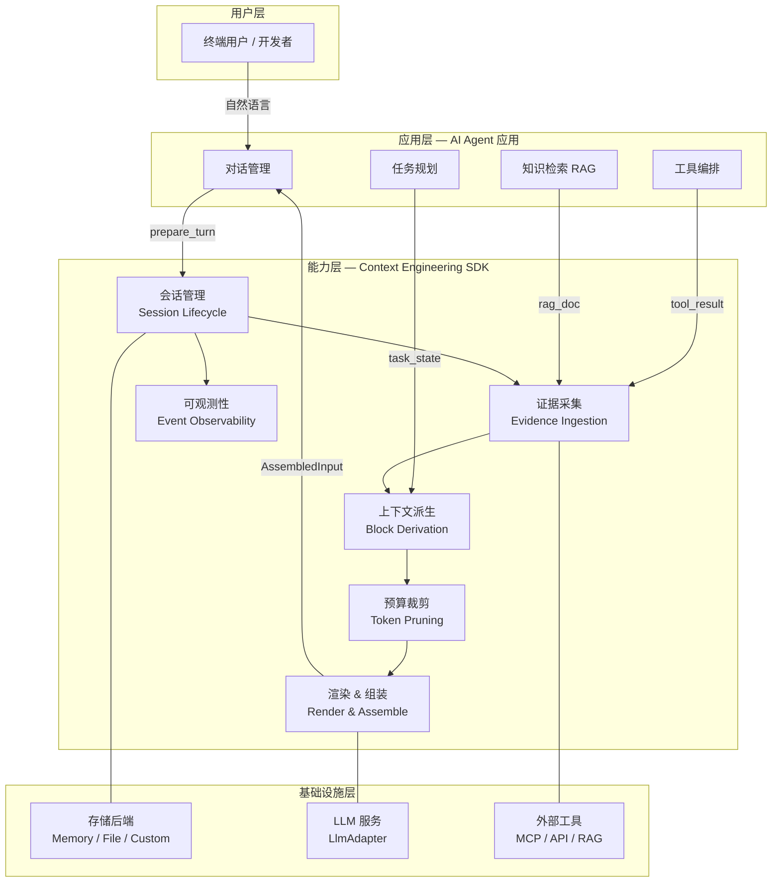

### 业务能力域说明

| 能力域 | 职责 | SDK 入口 |
|--------|------|----------|
| 会话管理 | 创建、加载、持久化会话文档，管理消息追加与版本控制 | `ContextEngine.prepare_turn()` |
| 证据采集 | 将外部信息（RAG 文档、工具结果、LLM 输出）统一存证，支持去重与脱敏 | `EvidenceIngestor.ingest()` |
| 上下文派生 | 从会话消息、任务状态、证据库派生出带优先级的上下文块 | `BlockDeriver.derive()` |
| 预算裁剪 | 按 must/high/medium/low 优先级和 token 预算进行贪心裁剪 | `Pruner.prune()` |
| 渲染 & 组装 | 解析 refs、渲染证据片段、按类型分组组装为最终模型输入 | `Renderer` + `Assembler` |
| 可观测性 | 通过 EventBus 发布结构化事件，支持审计、回放与排障 | `EventBus.emit()` |

---

## 3. 代码架构

### 3.1 包结构总览

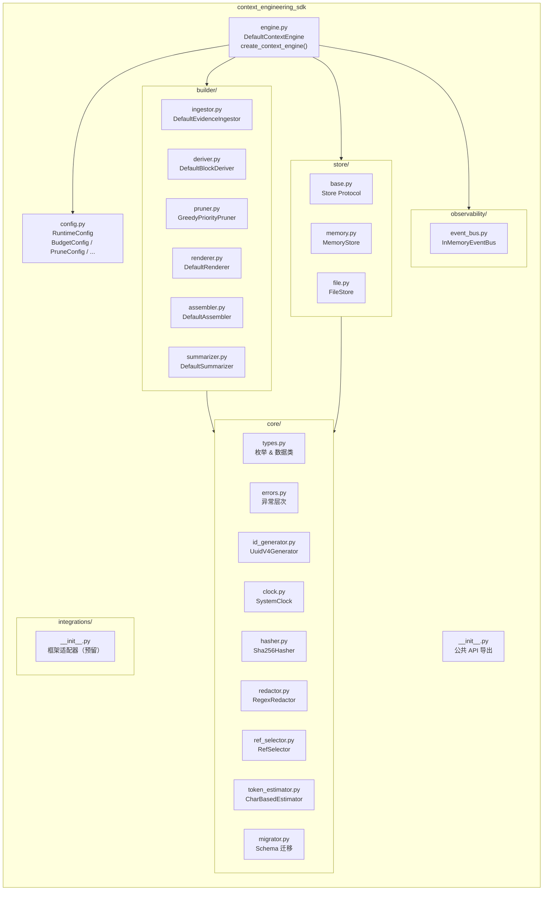

### 3.2 核心类依赖关系

```mermaid
classDiagram
    class ContextEngine {
        <<Protocol>>
        +prepare_turn(session_id, user_message, config) PrepareResult
        +commit_assistant_message(session_id, message, refs) PutResult
        +commit_assistant_chunk(session_id, chunk, index) void
        +finalize_assistant_message(session_id, refs) PutResult
        +record_tool_call(session_id, tool_call, evidence_ids) PutResult
        +record_model_usage(session_id, usage, evidence_id) PutResult
    }

    class DefaultContextEngine {
        -Store _store
        -TokenEstimator _tok
        -LlmAdapter _llm
        -EvidenceIngestor _ingestor
        -BlockDeriver _deriver
        -Pruner _pruner
        -Renderer _renderer
        -Assembler _assembler
        -Summarizer _summarizer
        -EventBus _event_bus
        -IdGenerator _id_gen
        -Clock _clock
        -Hasher _hasher
        -Redactor _redactor
        -RefSelector _ref_selector
    }

    class Store {
        <<Protocol>>
        +get_session(session_id) SessionDocument
        +put_session(session_id, doc) PutResult
        +append_messages(session_id, messages) PutResult
        +put_evidence(session_id, evidence) str
        +list_evidences(session_id, filter) list~Evidence~
        +put_context_blocks(session_id, blocks) PutResult
    }

    class EvidenceIngestor {
        <<Protocol>>
        +ingest(session_id, content, source, type, ...) tuple
    }

    class BlockDeriver {
        <<Protocol>>
        +derive(session_doc, evidences, options) list~ContextBlock~
    }

    class Pruner {
        <<Protocol>>
        +prune(blocks, budget, rules) PruneResult
    }

    class Renderer {
        <<Protocol>>
        +render_block(block, resolver, hints) RenderedBlock
    }

    class Assembler {
        <<Protocol>>
        +assemble(messages, rendered_blocks, model_hint) AssembledInput
    }

    class Summarizer {
        <<Protocol>>
        +should_summarize(session, config) bool
        +summarize(messages, summary, config) Summary
    }

    class EventBus {
        <<Protocol>>
        +emit(event) void
        +on(event_type, handler) void
        +off(event_type, handler) void
        +on_all(handler) void
    }

    class TokenEstimator {
        <<Protocol>>
        +estimate_text(text, model_hint) int
        +estimate_message(role, content) int
        +estimate_messages(messages) int
    }

    class LlmAdapter {
        <<Protocol>>
        +generate(request) LlmResponse
    }

    ContextEngine <|.. DefaultContextEngine : implements
    DefaultContextEngine --> Store
    DefaultContextEngine --> EvidenceIngestor
    DefaultContextEngine --> BlockDeriver
    DefaultContextEngine --> Pruner
    DefaultContextEngine --> Renderer
    DefaultContextEngine --> Assembler
    DefaultContextEngine --> Summarizer
    DefaultContextEngine --> EventBus
    DefaultContextEngine --> TokenEstimator
    DefaultContextEngine --> LlmAdapter

    Store <|.. MemoryStore : implements
    Store <|.. FileStore : implements

    class MemoryStore {
        -dict _sessions
    }
    class FileStore {
        -Path _base_dir
        -dict _versions
    }
```

### 3.3 Pipeline 组件职责

| 组件 | Protocol | 默认实现 | 职责 |
|------|----------|----------|------|
| Ingestor | `EvidenceIngestor` | `DefaultEvidenceIngestor` | 接收外部数据，去重（hash）、脱敏（regex）后存为 Evidence |
| Deriver | `BlockDeriver` | `DefaultBlockDeriver` | 从 Session 的 messages/task_state/evidences 派生 ContextBlock |
| Pruner | `Pruner` | `GreedyPriorityPruner` | 按优先级排序，在 token 预算内贪心选取 block |
| Renderer | `Renderer` | `DefaultRenderer` | 解析 block 上的 refs，通过 EvidenceResolver 加载内容片段 |
| Assembler | `Assembler` | `DefaultAssembler` | 将 rendered blocks 按类型分组，与 messages 合并为 AssembledInput |
| Summarizer | `Summarizer` | `DefaultSummarizer` | 判断是否需要摘要压缩，调用 LLM 生成滚动摘要 |

---

## 4. 部署架构

Context Engineering SDK 是一个嵌入式 Python 库（Library），不作为独立服务部署。以下展示 SDK 在典型 AI Agent 系统中的部署拓扑。

### 4.1 单体部署模式

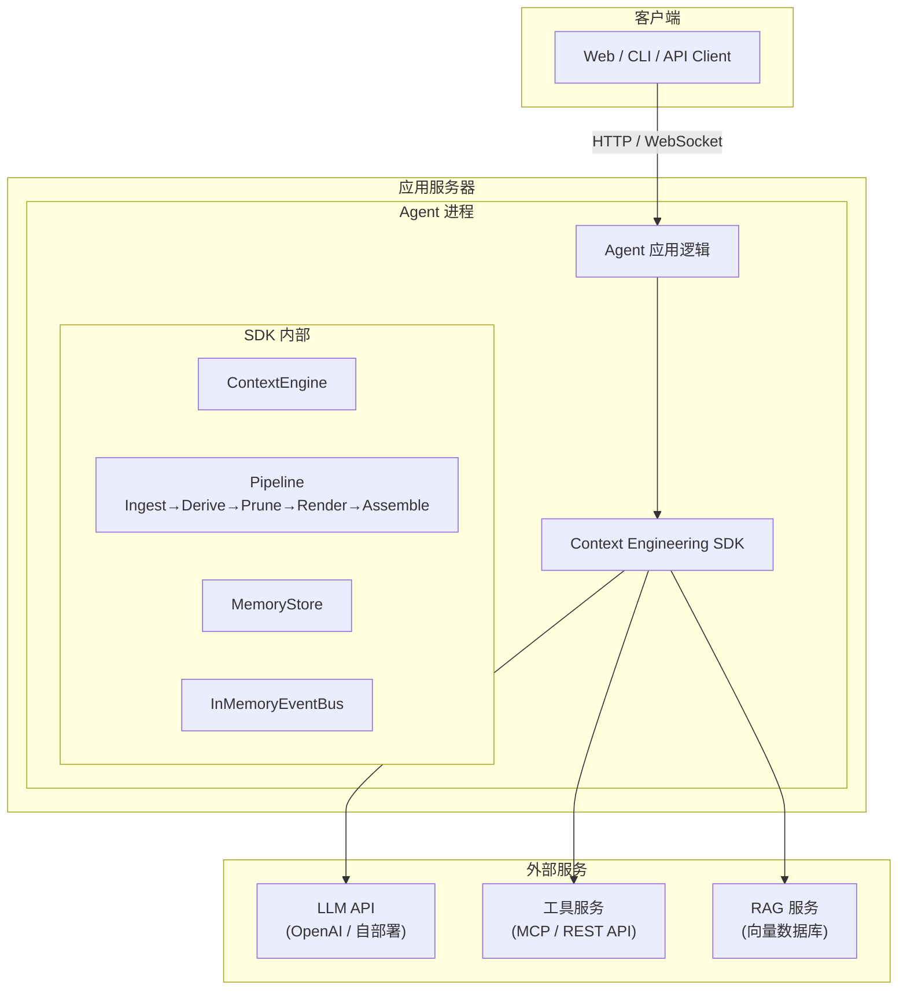

### 4.2 生产部署模式（带持久化）

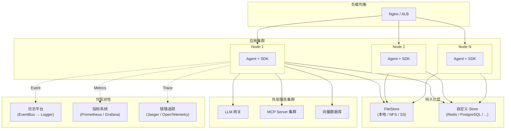

### 4.3 部署要求

| 维度 | 要求 |
|------|------|
| Python 版本 | >= 3.11 |
| 依赖 | 零外部运行时依赖（仅标准库） |
| 开发依赖 | pytest >= 7.0, pytest-asyncio >= 0.23 |
| 存储 | 内置 MemoryStore（测试用）和 FileStore（本地 JSON），生产建议实现自定义 Store |
| LLM | 用户自行实现 `LlmAdapter` Protocol，对接任意 LLM 服务 |

---

## 5. 信息架构

信息架构展示系统中核心数据实体的结构与关联关系。

### 5.1 数据模型全景

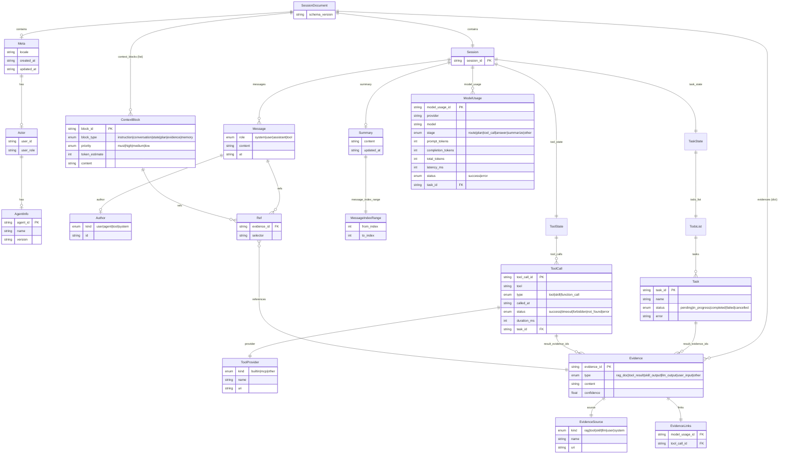

### 5.2 核心数据流

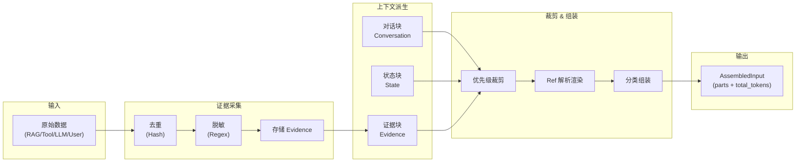

### 5.3 Block 优先级与裁剪规则

| 优先级 | Rank | 裁剪行为 | 典型来源 |
|--------|------|----------|----------|
| `must` | 0 | 永不丢弃，超预算则抛 `BudgetExceededError` | system message |
| `high` | 1 | 优先保留 | 最近 3 条消息、摘要、任务状态、高置信证据 |
| `medium` | 2 | 预算允许时保留 | 最近 4-10 条消息、中等置信证据 |
| `low` | 3 | 预算紧张时最先丢弃 | 早期历史消息、低置信证据 |

---

## 6. 核心时序图

### 6.1 prepare_turn 完整流程

此时序图展示 SDK 的核心方法 `prepare_turn()` 的完整执行流程。

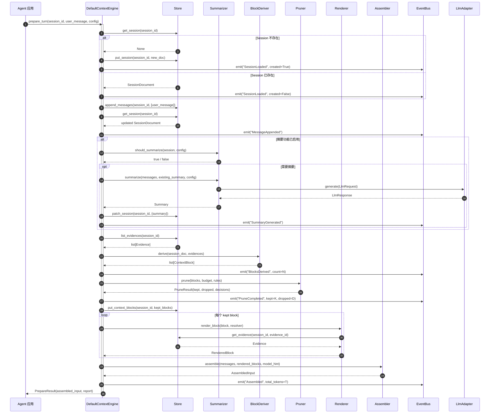

### 6.2 多轮对话完整生命周期

此时序图展示一次完整的多轮对话流程，包括 prepare → LLM 调用 → commit 三个阶段。

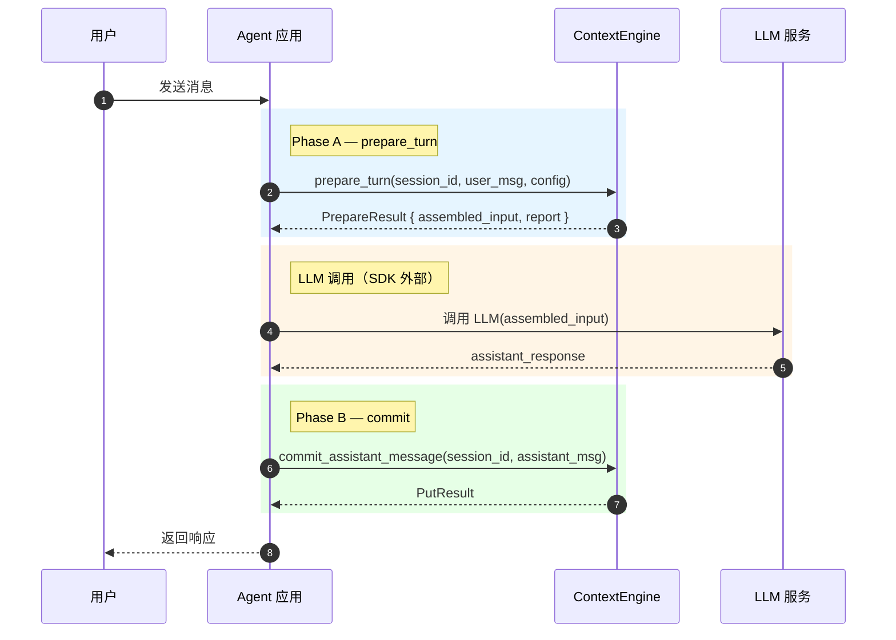

### 6.3 流式输出生命周期

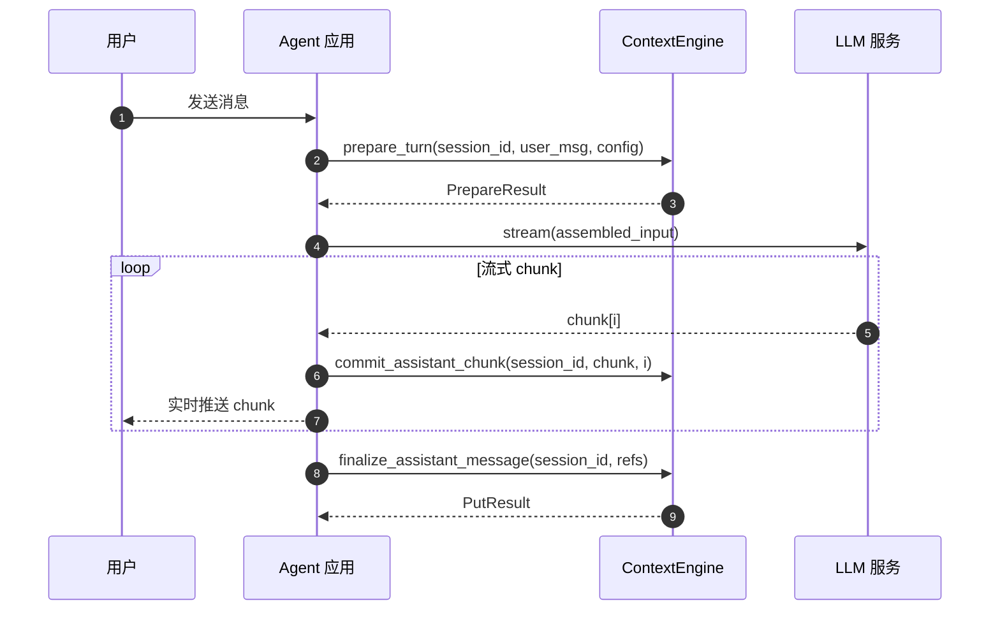

### 6.4 证据采集与工具调用记录

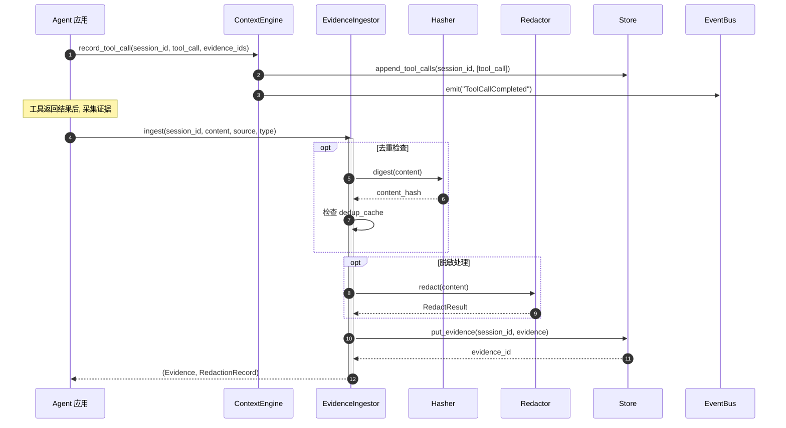

### 6.5 EventBus 事件流

以下列出 `prepare_turn` 过程中发布的全部事件类型及顺序：

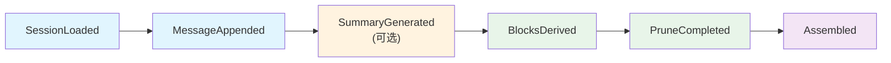

| 事件类型 | 触发时机 | payload 字段 |
|----------|----------|-------------|
| `SessionLoaded` | 会话加载/创建后 | `{created: bool}` |
| `MessageAppended` | 用户消息追加后 | `{role: str}` |
| `SummaryGenerated` | 摘要生成成功后 | — |
| `Degraded` | 摘要失败降级时 | `{reason: str}` |
| `BlocksDerived` | 上下文块派生完成 | `{count: int}` |
| `PruneCompleted` | 裁剪完成后 | `{kept: int, dropped: int}` |
| `Error` | must 块超预算时 | `{reason: str}` |
| `Assembled` | 最终组装完成 | `{total_tokens: int}` |
| `AssistantChunkReceived` | 流式 chunk 接收 | `{chunk_index, chunk_length}` |
| `AssistantMessageFinalized` | 助手消息最终化 | `{content_length: int}` |
| `ToolCallCompleted` | 工具调用记录 | `{tool, status, duration_ms}` |
| `ModelUsageRecorded` | 模型用量记录 | `{model, total_tokens}` |
